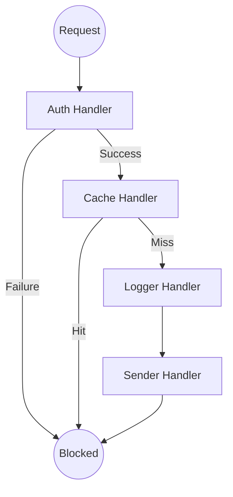
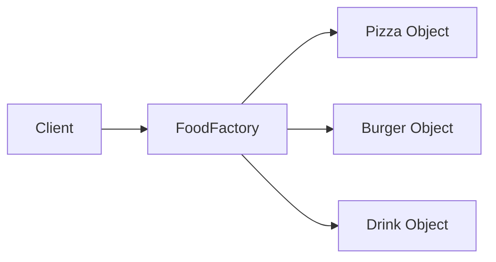
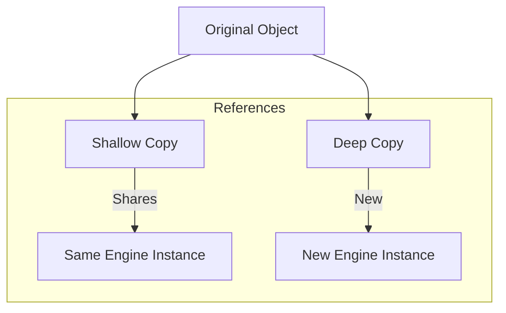
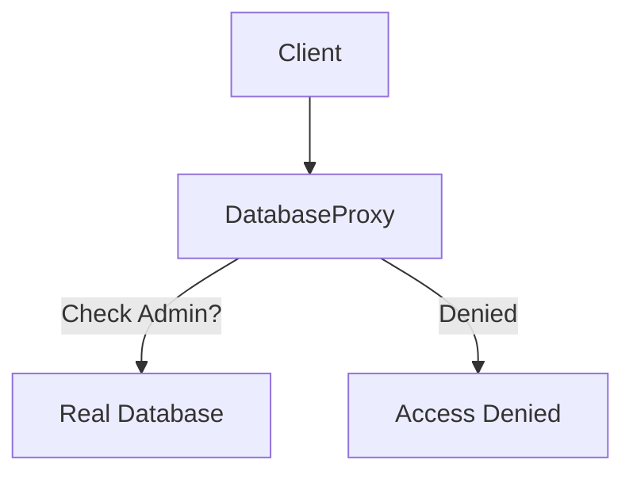
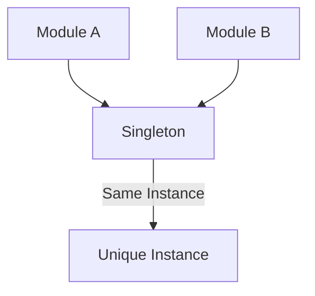

# Design Patterns Showcase


A comprehensive repository dedicated to exploring, implementing, and visualizing classic software design patterns in modern JavaScript and C# environments.

## Overview

Design patterns are documented solutions to common problems in software engineering. This project aims to provide:

- **Clean Implementations**: Minimalist and readable code across different languages.
- **Interactive Demos**: See the patterns in action with real-time UI (where applicable).
- **Visual Learning**: Mermaid diagrams and clear logical breakdowns.

---

## 1. Chain of Responsibility Pattern

The **Chain of Responsibility** allows a request to be passed along a chain of handlers. Each handler decides either to process the request or to pass it to the next handler.

### The Logic Flow



### Implementation
- **Location**: `chain/src/chain.js`
- **Key Logic**: Uses a base `Handler` class. Concrete handlers include `AuthHandler`, `CacheHandler`, `LoggerHandler`, and `SenderHandler`.

---

## 2. Factory Pattern

The **Factory** pattern is a creational pattern that provides an interface for creating objects in a superclass, but allows subclasses to alter the type of objects that will be created.

### The Logic Flow



### Implementation
- **Location**: `factory/factory.js`
- **Key Logic**: A `FoodFactory` class with a static `create(type)` method that returns specialized food instances based on a mapping object.

---

## 3. Prototype Pattern

The **Prototype** pattern is used when the type of objects to create is determined by a prototypical instance, which is cloned to produce new objects.

### The Logic Flow



### Implementation
- **Location**: `prototype/prototype.cs`
- **Key Logic**: A C# implementation in the `Car` class providing `ShallowCopy()` and `DeepCopy()` to manage object duplication and reference handling.

---

## 4. Proxy Pattern

The **Proxy** pattern provides a surrogate or placeholder for another object to control access to it.

### The Logic Flow



### Implementation
- **Location**: `proxy/index.js`
- **Key Logic**: A `DatabaseProxy` that intercepts calls to a `Database` object, performing role-based access control and lazy initialization.

---

## 5. Singleton Pattern

The **Singleton** pattern ensures a class has only one instance and provides a global point of access to it.

### The Logic Flow



### Implementation
- **Location**: `singleton/singleton.js`
- **Key Logic**: A `SettingsManager` that uses a static instance check and `Object.freeze` to guarantee a single, immutable instance throughout the app lifecycle.

---

## Getting Started

### Prerequisites

- **Node.js** (v18.x or higher)
- **.NET SDK** (for C# examples)

### Installation

1. Clone the repository:
   ```bash
   git clone https://github.com/ibrahimabdullaziz/Design-Patterns.git
   ```

2. To run the React demo:
   ```bash
   cd chain
   npm install
   npm run dev
   ```

---

## License

This project is licensed under the MIT License.
